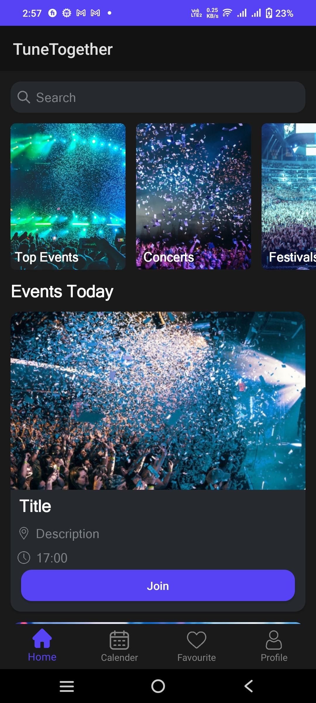
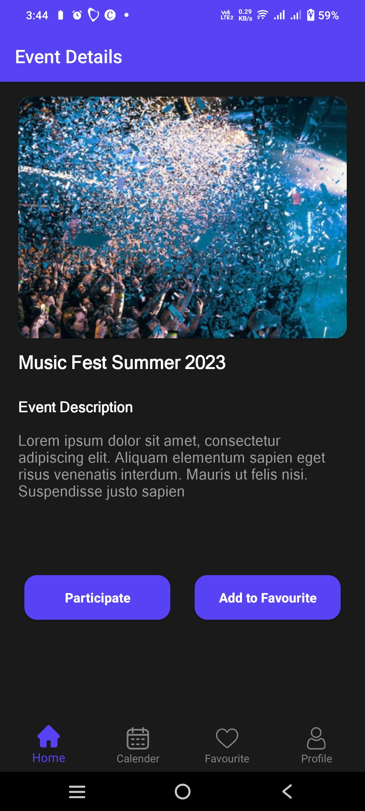
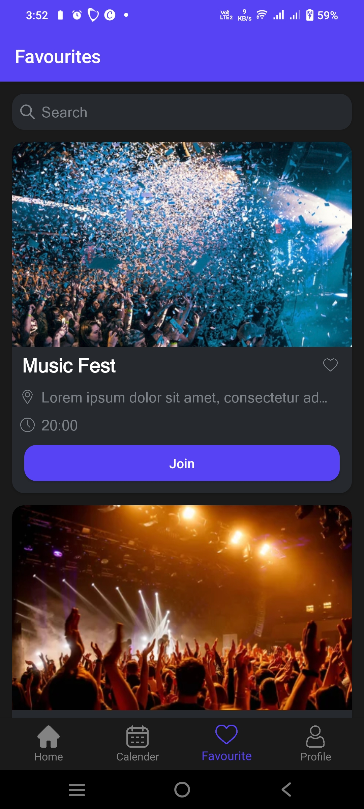
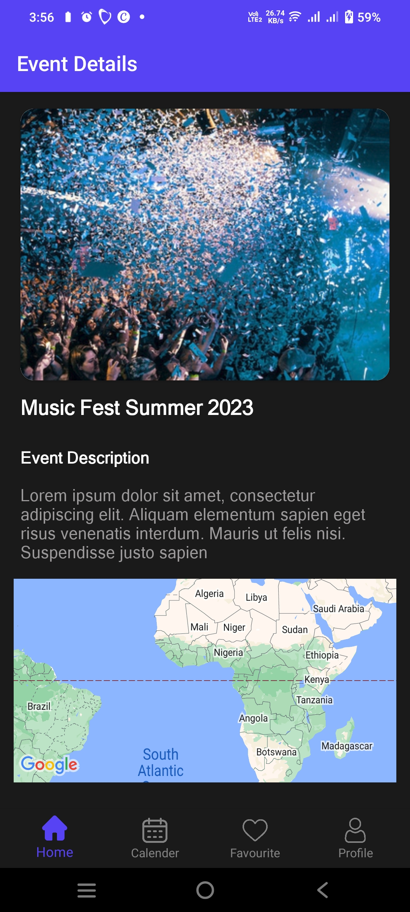

# Tune Together

Tune Together is a social event discovery app that helps users find and join events happening in their area. The app allows users to tune in, form groups, chat, and see who else is attending the event, making it easier to team up and enjoy experiences together.

## Features
- **Event Discovery:** Displays events from APIs based on the user's location.
- **Join & Group Up:** Users can join events and see who else is attending.
- **Chat Functionality:** Enables attendees to communicate and coordinate before the event.
- **User-Friendly Interface:** Intuitive and seamless navigation for exploring events.

## Tech Stack
- **Programming Language:** Java
- **Backend Services:** Firebase
- **Networking:** Retrofit (for API calls)
- **UI Components:** XML
- **Design:** Figma
- **APIs:** Integrated third-party event APIs
- 
## Screenshots

Here are some screenshots of the app:

|  |  |  |
| ---------------------------------------------------- | ---------------------------------------------------- | ---------------------------------------------------- |
|  | |  |


## Installation
1. Clone the repository:
   ```sh
   git clone https://github.com/yAhyan-Official/tune-together.git
   ```
2. Open the project in Android Studio.
3. Configure Firebase and add the necessary API keys.
4. Build and run the application on an emulator or physical device.

## Usage
1. Allow location permissions for personalized event recommendations.
2. Browse events displayed on the home screen.
3. Tap on an event to view details and attendees.
4. Join an event and use the chat feature to connect with other participants.

## Contributing
Contributions are welcome! Feel free to submit a pull request or open an issue for feature requests and bug reports.

## License
This project is licensed under the MIT License.
